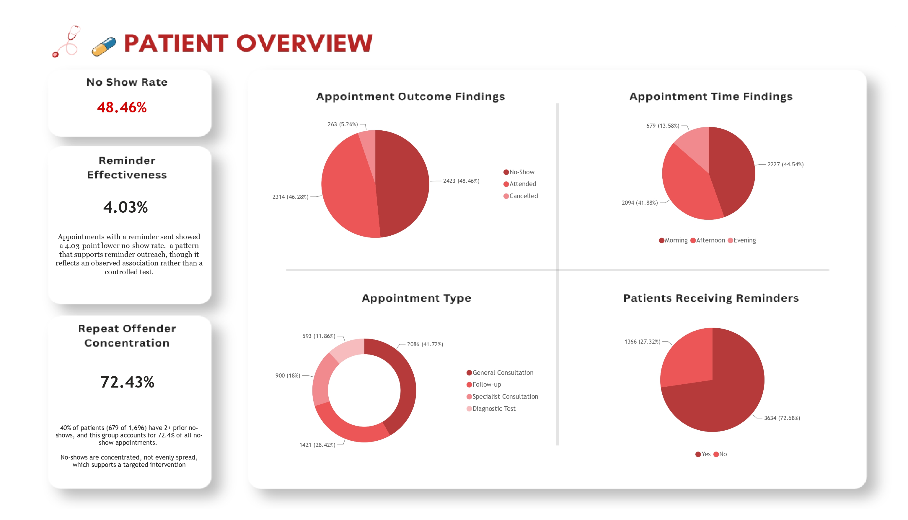

# HealthConnect-Lab
For Week 4 on the AnalystLab Africa Internship, I'm looking at HealthConnect data. . The goal for the project is to understand which factors are associated with patients missing scheduled appointments, quantify the operational impact, and produce data-driven insights and KPIs that clinic staff can use to identify high-risk appointments and inform intervention decisions.

# Week 5 Project Continuation
For Week 5, I delved into the HealthConnect data, examining appointment no-shows and cancellations for a healthcare provider, using 5,000 appointment records to identify the strongest factors associated with missed appointments and produce actionable KPIs and dashboards for clinic operations.

## Problem
Missed appointments (no-shows) cost clinics wasted capacity, staff time, and delayed care for other patients. This project analyzes appointment-level data to find out how the clinic can use their data to reduce missed appointments and improve patient support experience.

## Key Findings
• No-show rate: 48.46% (2,423 of 5,000 appointments)
•	Reminder effectiveness: reminders are associated with a 4.03pp (≈7.85% relative) reduction in no-shows
•	Repeat-offender concentration: 40% of patients (679 of 1,696) account for 72.4% of all no-shows — the highest-leverage finding for targeting intervention
•	Confirmed prior no-show history remains the strongest associated factor

Used Power BI (Power Query + DAX) for KPI calculation and dashboard visualization.
